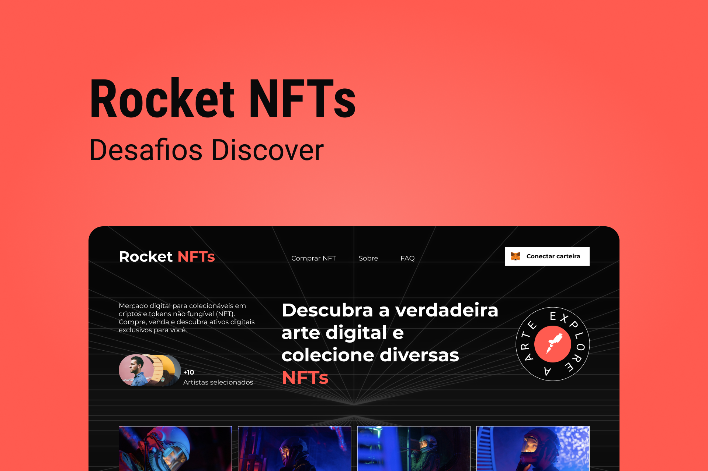

<h1 align="center"> Rocket NTFs </h1>
 

  

## ✅ Deploy 

- CLIQUE AQUI [Henrriky.github.io/RocketNFT/]

## 💻 Projeto

Neste desafio você deverá desenvolver uma landing page completa sobre NFTs.

## 🚀 Tecnologias

Esse projeto foi desenvolvido com as seguintes tecnologias:

- HTML e CSS
- Javascript
- Git e Github
- Figma
- Biblioteca do Scroll Reveal

## ✅ Requisitos

- Seguir o layout do Figma.
- Adicionando animações na landing page.
